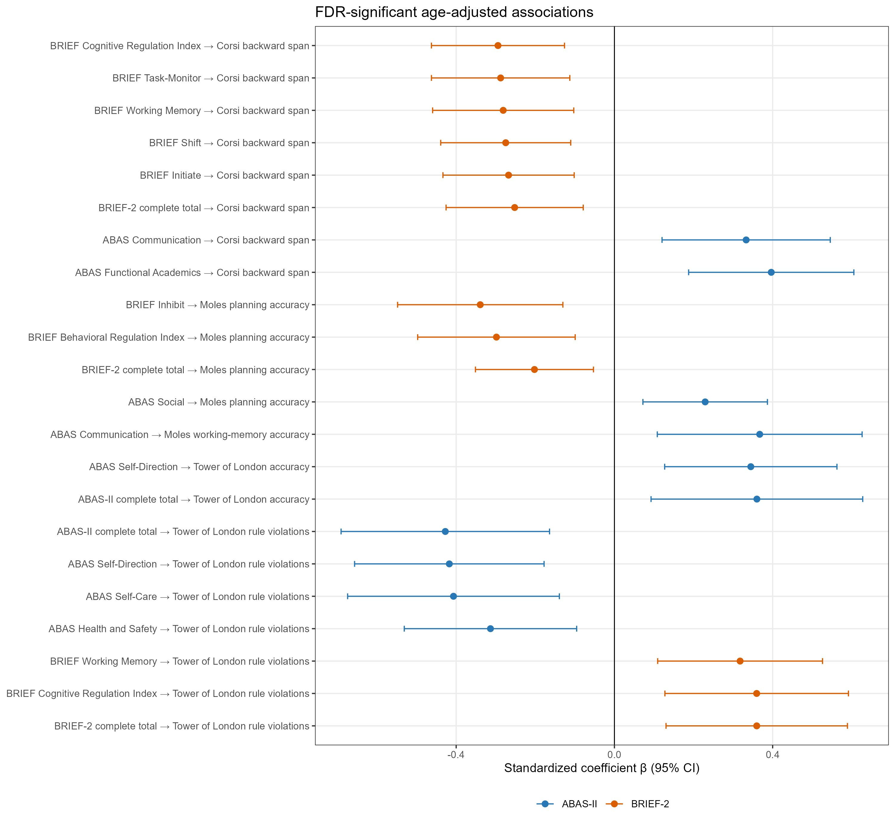

# Methods

## Participants

The source database comprised 101 typically developing Italian children aged
5–7 years. Participants were recruited from the third year of two preschools
(“D. Ricci” in Acquasparta and “G. S. Bernardo” in Narni) and from the first
and second years of four primary schools (“A. B. Sabin” in Acquasparta,
Montecchio Primary School, “Narni S. Lucia,” and “Narni Centro”). Eligibility
criteria were native Italian language, no primary sensory deficits, no
neurological conditions, and no significant psychiatric or developmental
disorders. The study followed the principles of the Declaration of Helsinki.
Written informed consent was obtained from parents and assent from each child.
General non-verbal cognitive functioning was screened with Raven’s Coloured
Progressive Matrices [@raven1995]. Age-specific screening thresholds were
applied to the baseline Raven accuracy score. Two children met these criteria,
resulting in a primary analytic sample of 99 children (54 boys and 45 girls;
mean age = 6.43 years, SD = 0.64, range = 5–7).

## Procedure

Children were assessed individually in a quiet room at school. Only measures
collected at the baseline assessment were used. The order of the cognitive
tests was counterbalanced across participants. The present cross-sectional
study used only measurements obtained during this assessment.

## Measures

### Corsi Block-Tapping Test

The Corsi Block-Tapping Test [@corsi1972; @monaco2013span] assessed
visuospatial short-term and working memory using nine blocks arranged in an
irregular spatial configuration. In the forward condition, children reproduced
the examiner’s sequence in the same order; in the backward condition, they
reproduced it in reverse order. The longest correctly reproduced sequence was
recorded as forward span and backward span.

### Tower of London

The Tower of London [@shallice1982] assessed planning, problem solving,
anticipation of consequences, and adherence to task rules. Children reproduced target
configurations by moving coloured balls across pegs while respecting movement
and peg-capacity rules. The present analyses used total accuracy and rule
violations. Higher accuracy indicated better
performance, whereas fewer violations indicated better rule-governed planning.

### Moles Task

The computerised Moles Task is a child-friendly adaptation of the Digital
Minefield Task (DMT), which was developed to isolate and assess spatial working
memory and planning both separately and in combination. The DMT is itself a
computerised adaptation of the physical Minefield Task described by Bocchi et
al. [-@bocchi2022]. The Moles Task assessed spatial memory, navigation, and
visuospatial planning on an 8 × 8 grid. In the working-memory condition,
children viewed and subsequently recalled mole locations; working-memory
accuracy was analysed. In the planning condition, children traced a route from
start to finish while avoiding visible obstacles; planning accuracy and the
planning efficiency of the path were analysed. In the
working-memory-planning condition, obstacles disappeared before the response,
requiring their locations to be remembered while a route was planned; accuracy
and planning efficiency of the path were analysed.

The efficiency variables represented the stored difference between tiles
traversed and the corresponding minimum-path tiles; lower values indicated a
path closer to the recorded minimum.

### ABAS-II

Teachers completed the Adaptive Behavior Assessment System, Second Edition
(ABAS-II) [@harrison2003; @ferri2014] to assess adaptive functioning and
everyday autonomy in the school context. The analysed standard scales were
Communication, Functional Academics, School Living, Health and Safety,
Leisure, Self-Care, Self-Direction, and Social functioning. A local complete
total was calculated only when all eight standard scales were present.

### BRIEF-2

Teachers completed the Behavior Rating Inventory of Executive Function,
Second Edition (BRIEF-2) [@gioia2015]. The analysed scales were Inhibit,
Self-Monitor, Shift, Emotional Control, Initiate, Working Memory,
Plan/Organize, Task-Monitor, and Organization of Materials. The Behavioral
Regulation Index (BRI), Emotional Regulation Index (ERI), and Cognitive
Regulation Index (CRI) were also analysed. A local complete total was
calculated only when all nine standard scales were present. Higher BRIEF-2
scores indicated greater everyday executive-function difficulties.

## Statistical Analysis

Analyses were conducted in R using readxl, sandwich, openxlsx, and ggplot2. The
analysis was cross-sectional and restricted to the nine prespecified baseline
outcomes. Participant characteristics, missingness, variable distributions,
and Pearson correlation matrices were summarised descriptively; correlations
were not treated as an additional inferential testing family.

For every questionnaire–outcome association, the outcome, questionnaire
predictor, and age were standardised within the relevant complete-case sample.
Age-adjusted ordinary least-squares models were then estimated:

```text
standardized outcome ~ standardized questionnaire predictor + standardized age
```

HC3 heteroskedasticity-consistent standard errors and 95% confidence intervals
were used [@mackinnon1985]. Standardised β, raw *p*, adjusted and unadjusted
R², the increase in R² over an age-only model, and partial R² were retained.
The ABAS-II and BRIEF-2 totals were first tested separately. A joint-total
model additionally included both totals simultaneously. Standard ABAS-II
scales, standard BRIEF-2 scales, and BRIEF-2 indices were otherwise entered
one at a time with age.

Benjamini–Hochberg false-discovery-rate correction [@benjamini1995] was
applied separately to five prespecified coefficient families: separate totals
(18 tests), joint totals (18), ABAS-II scales (72), BRIEF-2 scales (81), and
BRIEF-2 indices (27). Statistical significance was defined as FDR-adjusted
*q* < .05. Variance-inflation factors were calculated for the joint-total
models. For FDR-significant models, residual shape, leverage, externally
studentised residuals, Breusch–Pagan statistics, and Cook’s distance were
examined. The threshold 4/*n* was used to flag influential observations for
reporting only; no observation was automatically removed. Reporting was
guided by STROBE and SAMPL recommendations [@vonelm2007; @lang2015].

# Results

## Participants and Descriptive Statistics



: Participant flow and composition of the analytic sample. {#tbl-participants}

@tbl-participants summarises the transition from the source database to the
Raven-screened analytic sample. @tbl-outcomes describes the nine baseline outcomes. The complete
ABAS-II total was available for 95 children and the complete BRIEF-2 total for
96 children; model-specific sample sizes also reflected outcome missingness.



: Descriptive statistics for the nine baseline outcomes. {#tbl-outcomes}

The descriptive audit retained one negative `PLANNING_EFF` value and three
negative `PWM_EFF` values. No case was changed or excluded on the basis of an
EFF value.

## Primary Age-Adjusted Models



The distribution of significant results across the prespecified FDR families is
reported in @tbl-fdr-families.



: Results of FDR correction within each prespecified family. {#tbl-fdr-families}

### Complete Questionnaire Totals

The FDR-significant associations involving questionnaire total scores are
reported in @tbl-total-scores.



: FDR-significant associations involving questionnaire total scores. {#tbl-total-scores}

### Questionnaire Scales and BRIEF-2 Indices

The corresponding results for questionnaire scales and BRIEF-2 indices are
reported in @tbl-scales-indices. All FDR-significant associations are displayed
with their 95% confidence intervals in @fig-significant-associations.



: FDR-significant associations involving questionnaire scales and BRIEF-2 indices. {#tbl-scales-indices}

{#fig-significant-associations fig-alt="Forest plot of FDR-significant standardized regression coefficients with 95% confidence intervals." width=95%}

## Model Diagnostics

Diagnostic quantities for every FDR-significant model are reported in the
analysis workbook and accompanying CSV table. They were used to characterise
model fit and potentially influential observations; no participant was removed
on the basis of these diagnostics.
